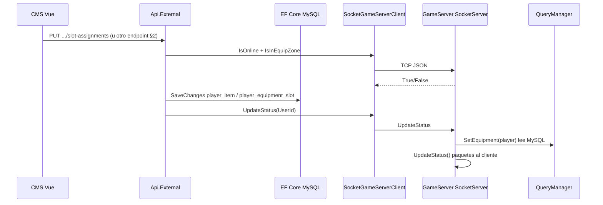

# Flujo: equipamiento del jugador y sincronización con el Game Server

Este documento describe cómo se carga el equipamiento, dónde vive la verdad de datos y cómo se sincronizan los cambios entre el **CMS/API (.NET)**, la **base de datos** y el **servidor de juego** cuando el jugador está en sesión.

## Resumen ejecutivo

| Capa | Rol |
|------|-----|
| **MySQL** (`player_item`, `player_equipment_slot`, `player_equipment`, `player_accounts`, etc.) | Fuente de verdad: instancias de ítems y ranuras equipadas; otras columnas de `player_equipment` (p. ej. boosters, skill tree) según el esquema vigente. |
| **Api.External — REST v1 (`ShipEquipmentService`)** | Hangar CMS: inventario y equipo vía `player_item` / `player_equipment_slot`; tras guardar, si el jugador está **online**, notifica al Game Server (`NotifyGameServerIfOnlineAsync` → `UpdatePlayerStatus`). |
| **Game Server (`MexOrbit.GameServer`)** | Al **entrar al juego**, carga equipamiento desde MySQL (`QueryManager`). Tras un cambio desde CMS, recibe **`UpdateStatus`** y **vuelve a leer** MySQL para recalcular stats en memoria. |
| **Cliente en mapa** | La zona de hangar actualiza `IsInEquipZone`; el CMS pregunta al Game Server por socket si el jugador puede equipar. |

No hay un “push” continuo del equipamiento: la sincronización en vivo es **escribir BD → comando `UpdateStatus` → el Game Server relee la BD**.

Para el **orden de inicialización del cliente en mapa** (login, socket, `LoginRequestHandler`, etc.): [game-client-initialization.md](./game-client-initialization.md).

---

## 1. Inicio de sesión en el juego (cliente en mapa)

1. El jugador completa el login y entra a un mapa.
2. El Game Server carga la entidad del jugador con **`QueryManager.GetPlayer(playerId)`** (MySQL directo, no EF).
3. Se lee la fila `player_equipment` (entre otras tablas) para datos auxiliares (items JSON, pet, boosters, etc., según el esquema actual).
4. Se llama a **`QueryManager.SetEquipment(player)`**, que:
   - Vuelve a ejecutar `SELECT * FROM player_equipment WHERE userId = ...`
   - Interpreta las columnas de configuración disponibles (`config1_lasers`, `config1_generators`, `config1_drones`, etc., y config 2) para calcular **daño, escudo, velocidad** y construir `player.Equipment` (`EquipmentBase` / `ConfigsBase`).

**Archivos clave**

- `MexOrbit.Server/Service/MexOrbit.GameServer/Managers/QueryManager.cs` — `GetPlayer` (llama a `SetEquipment` al final) y **`SetEquipment`**: lógica de stats a partir de datos en MySQL.

**Importante:** el Game Server **no** recibe el inventario por un canal distinto a la BD en el login: **todo sale de MySQL** en ese momento.

**Detalle de fórmulas (daño, escudo, HP, velocidad, drones):** ver [equipment-stats-calculation.md](./equipment-stats-calculation.md).

---

## 2. CMS / Vue / API REST v1 (hangar)

El hangar en **MexOrbit.CMS** consume **`/api/v1/equipment`** con **`ShipEquipmentService`** (`IShipEquipmentService`). La verdad de datos del equipo de nave y drones en configs 1/2 está en **`player_equipment_slot`** (y las instancias en **`player_item`**); reglas de negocio (SLE, exclusión CPU/REP, geometría de ranuras, etc.) viven en **`ShipEquipmentService`**.

### 2.1 Lectura (pantalla de inventario / equipo)

| Método | Ruta | Uso |
|--------|------|-----|
| `GET` | `/api/v1/equipment/player-items` | Instancias de inventario (`player_item` + `server_item`). |
| `GET` | `/api/v1/equipment/ship-loadout` | Nave actual, naves poseídas, configs 1/2 con `slots` desde `player_equipment_slot` (incl. `extraSlotCapacity` cuando aplica). |

### 2.2 Escritura (equipar / desequipar / nave)

| Método | Ruta | Uso |
|--------|------|-----|
| `PUT` | `/api/v1/equipment/ship-configurations/{id}/slot-assignments` | Asignar o vaciar ranura (`SlotAssignmentRequest`: `slotKind`, `sortOrder`, `droneSlotIndex`, `playerItemId`, campos de dron si aplica). |
| `DELETE` | `/api/v1/equipment/ship-configurations/{id}/slot-assignments` | Quitar equipo de una ranura concreta (query params). |
| `DELETE` | `/api/v1/equipment/ship-loadout` | Vaciar loadout (opcionalmente una config). |
| `POST` | `/api/v1/equipment/ship/design` | Cambiar diseño de nave (`lootId`). |
| `POST` | `/api/v1/equipment/ship/change` | Cambiar clase de nave (`lootId`). |

Tras operaciones que modifican equipo o nave, **`ShipEquipmentService`** aplica **`CanModifyEquipmentAsync`** (online + zona de hangar cuando corresponde) y **`NotifyGameServerIfOnlineAsync`** para mantener coherencia con el mapa.

**Archivos clave**

- `MexOrbit.Server/Api/MexOrbit.Api.External/Controllers/EquipmentController.cs` — `[Route("api/v1/equipment")]`.
- `MexOrbit.Server/Domain/MexOrbit.DomainService/ShipEquipmentService.cs` — persistencia y validación REST.
- `MexOrbit.Server/Domain/MexOrbit.DomainService.Core/IShipEquipmentService.cs` — contrato.
- Cliente: `MexOrbit.CMS/src/services/equipmentService.ts`, `stores/equipment.ts`.

Para **mostrar** datos no hace falta hablar con el Game Server: todo sale de MySQL vía EF. Las comprobaciones **online + zona de equip** usan el cliente socket (`IGameServerClient`) desde el servicio de dominio.

**Nota:** el Game Server puede seguir recalculando combate desde las columnas de **`player_equipment`** usadas hoy en `QueryManager.SetEquipment` hasta que ese lector se alinee con **`player_equipment_slot`** y el catálogo (ver §7).

---

## 3. Cambios de equipamiento desde el CMS (jugador desconectado)

1. El cliente llama a los endpoints de la §2 (`PUT`/`DELETE` de slot-assignments, etc.) → **`ShipEquipmentService`**.
2. Validación: **offline** **o** **online + en zona de equipamiento** (ver sección 4).
3. `SaveChangesAsync` persiste en **`player_item`** / **`player_equipment_slot`** (y en `player_accounts` / `player_equipment` si el flujo toca esas tablas).
4. Si **`IsPlayerOnlineAsync`** es falso, **no** se envía `UpdateStatus` al Game Server (no hace falta).

---

## 4. Cambios de equipamiento con el jugador conectado y en zona de equipamiento

### 4.1 Reglas en la API (`ShipEquipmentService`)

Para asignar o quitar ranuras, cambiar diseño o clase de nave, el servicio usa:

1. `IsPlayerOnlineAsync(userId)` → socket al Game Server, acción **`IsOnline`**.
2. Si está online: `IsPlayerInEquipZoneAsync(userId)` → acción **`IsInEquipZone`**.
3. Solo si **offline** o **(online y en zona de equip)** se permite la operación; si no, error tipo *"Equipping isn't possible. You must be at a location with a hangar facility!"* (u otro código según el caso).

**Archivo:** `ShipEquipmentService.cs` — `CanModifyEquipmentAsync`, `AssignSlotAsync`, `RemoveSlotAsync`, `ChangeShipDesignAsync`, `ChangeShipClassAsync`, etc.

### 4.2 Qué responde el Game Server (socket TCP)

El cliente de socket está en:

- `MexOrbit.Server/Infrastructure/MexOrbit.Infrastructure.Socket/SocketGameServerClient.cs`

Acciones usadas para equipamiento:

| Acción (JSON `Action`) | Uso |
|------------------------|-----|
| `IsOnline` | ¿Hay sesión de juego activa para este `UserId`? |
| `IsInEquipZone` | ¿El jugador está en zona de hangar? (ver abajo) |
| `AvailableToChangeShip` | Cooldown ~5 s para cambiar nave (diseño/clase) |
| `UpdateStatus` | Tras guardar equipo en BD: **sincronizar** stats en el Game Server |
| `ChangeShip` | Tras cambiar `shipId` en BD: aplicar nave en el mapa |

**Interfaz:** `IGameServerClient` — `MexOrbit.Server/Infrastructure/MexOrbit.Infrastructure.Core/IGameServerClient.cs`

### 4.3 Dónde se marca “zona de equipamiento” en el mapa

- `Storage.IsInEquipZone` en el jugador (`Game/Objects/Storage.cs`).
- `Spacemap` actualiza según posición (estaciones, reparación, etc.) y envía al cliente comandos tipo equip ready / not ready.

**Archivo de referencia:** `Game/Spacemap.cs` (búsqueda `IsInEquipZone`, `EquipReadyCommand`).

### 4.4 Handler del socket en el Game Server

`SocketServer.cs` recibe JSON `{ Action, Parameters }` y ejecuta:

- **`UpdateStatus`** → `SocketServer.UpdateStatus(player)` → **`QueryManager.SetEquipment(player)`** → `player.DroneManager.UpdateDrones(...)` → `player.UpdateStatus()` (paquetes de HP/escudo al cliente).

**Archivo:** `MexOrbit.Server/Service/MexOrbit.GameServer/Net/SocketServer.cs` — casos `UpdateStatus`, `IsOnline`, `IsInEquipZone`, `ChangeShip`, `AvailableToChangeShip`.

**Efecto de `SetEquipment`:** vuelve a leer **`player_equipment` desde MySQL** y recalcula el objeto `Equipment` del jugador en memoria para el combate.

---

## 5. Sincronización: secuencia recomendada (mental)

Si el jugador **no** está online, solo se ejecuta `SaveChanges` (sin `UpdateStatus`).

---

## 6. Cambio de nave (diseño o clase)

- Tras persistir `player_accounts.shipId` y/o datos de equipo, **`ShipEquipmentService`** llama a **`ChangePlayerShipAsync`** / notificaciones según el flujo (`Socket` → acción **`ChangeShip`** con `UserId`, `ShipId` cuando aplique).
- En el Game Server: `SocketServer.ChangeShip` → `player.ChangeShip` → de nuevo **`QueryManager.SetEquipment`** y reinicio de presencia en mapa.

**Archivos:** `ShipEquipmentService.cs` (`ChangeShipDesignAsync`, `ChangeShipClassAsync`), `SocketServer.cs` (`ChangeShip`), `Player.cs` (`ChangeShip`).

---

## 7. Coherencia entre EF (API) y lecturas MySQL (Game Server)

- Ambos deben apuntar a la **misma base de datos** y esquema.
- La API escribe el equipo de nave/drones en **`player_equipment_slot`** (vía `ShipEquipmentService`).
- El Game Server **no** usa EF; usa SQL en texto. Mientras **`QueryManager.SetEquipment`** derive stats de las columnas de **`player_equipment`** que use hoy el código del GS, conviene **alinear** ese lector con las mismas instancias/ranuras que la API (`player_equipment_slot` + catálogo) para que combate y hangar coincidan.

---

## 8. Referencia rápida de archivos

| Tema | Ruta |
|------|------|
| API hangar REST v1 | `Api/MexOrbit.Api.External/Controllers/EquipmentController.cs` (`api/v1/equipment`) |
| Lógica equipo (slots, nave) | `Domain/MexOrbit.DomainService/ShipEquipmentService.cs` |
| Contrato Game Server | `Infrastructure/MexOrbit.Infrastructure.Core/IGameServerClient.cs` |
| Cliente TCP hacia GS | `Infrastructure/MexOrbit.Infrastructure.Socket/SocketGameServerClient.cs` |
| Carga y stats en mapa | `Service/MexOrbit.GameServer/Managers/QueryManager.cs` (`GetPlayer`, `SetEquipment`) |
| Comandos socket entrantes | `Service/MexOrbit.GameServer/Net/SocketServer.cs` |
| Zona equip en mapa | `Service/MexOrbit.GameServer/Game/Spacemap.cs`, `Game/Objects/Storage.cs` |
| Frontend Vue | `MexOrbit.CMS/src/stores/equipment.ts`, `services/equipmentService.ts` |

---

## 9. Limitaciones actuales (para contexto)

- La sincronización en vivo depende de que el **Game Server esté accesible** por TCP (host/puerto configurados) y de que `UpdateStatus` se ejecute sin error; si falla, la API puede haber guardado bien la BD pero el jugador en mapa seguiría con stats viejos hasta reloguear u otro disparador de `SetEquipment`.
- **`QueryManager.SetEquipment`** usa hoy heurísticas/rangos sobre datos en **`player_equipment`**; el trabajo pendiente es **alinear** ese cálculo con el modelo de ranuras (`player_equipment_slot`) y **`server_item`** para que coincida con lo que valida y muestra `ShipEquipmentService`.

---

*Última actualización: flujo API unificado en `ShipEquipmentService` / `EquipmentController`; revisar rutas si se mueven proyectos dentro de la solución.*
