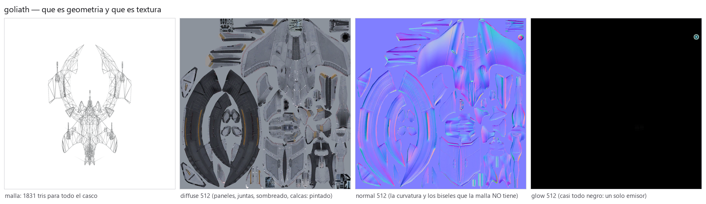
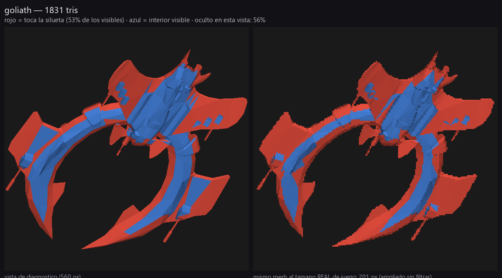
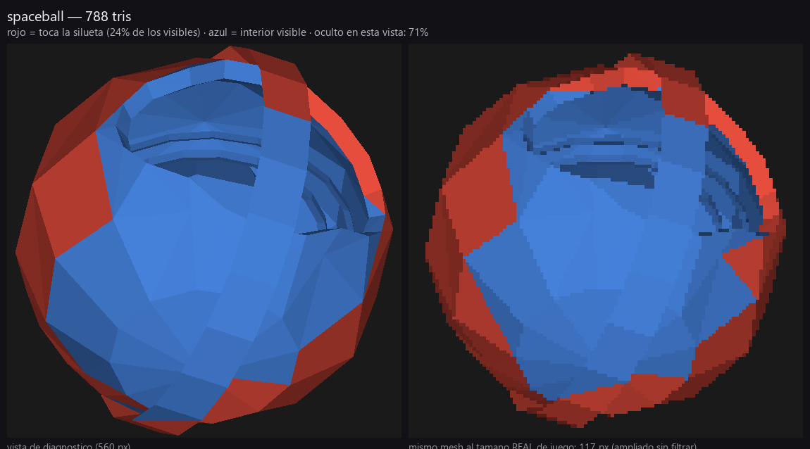
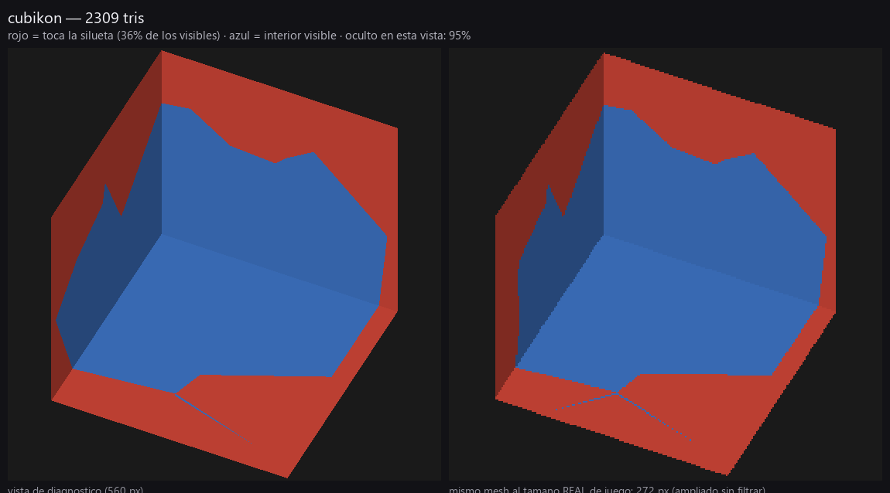
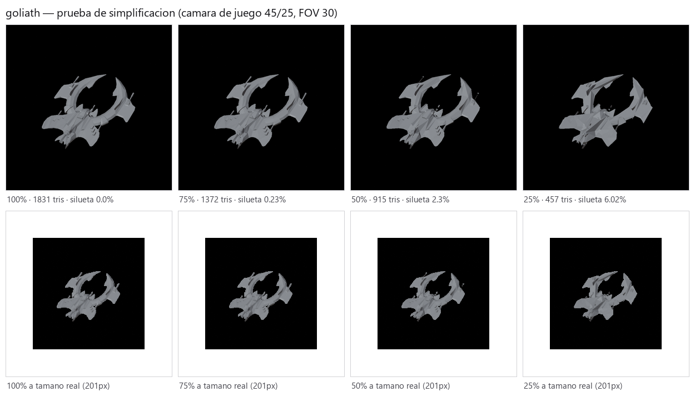

# DARKORBIT ASSET ANALYSIS

**Ingeniería inversa de la geometría del cliente clásico de DarkOrbit.**
Estudio técnico, 4 de septiembre de 2026. Referencia exclusivamente técnica: se
estudia **cómo** resolvieron el problema, no **qué** diseñaron. Ningún diseño,
silueta, proporción ni identidad visual de DarkOrbit se traslada a Astrion.

> Todo número de este documento sale de medir los ficheros. Lo que no se pudo
> comprobar con los archivos disponibles está marcado explícitamente como **no
> verificable**. Las herramientas están en
> [`mex-orbit-art/tools/asset-audit/`](../../../mex-orbit-art/tools/asset-audit/)
> y los datos crudos en [`datos/`](datos/).

---

## 0. Qué se midió

| Fuente | Contenido |
|---|---|
| `spacemap/3d/meshes/` | **322 mallas AWD2** (naves, NPCs, drones, pets, estructuras, portales, ambiente) |
| `spacemap/3d/fx/` | **126 mallas AWD2** de efectos |
| `spacemap/3d/textures/` | **4.401 texturas ATF** (Stage3D) |
| `main.swf` → `binaryData/*.bin` | **395 entradas `<display3D>`**: geometría, escala, clase de textura, `visualSize` |
| `scripts/§_-J0§/Settings3D.as` | tabla de tamaño de textura por clase y nivel de calidad |
| `03-guidelines/darkorbit-3d/camara-proyeccion.md` | cámara (ingeniería inversa previa del proyecto) |

Los 448 AWD se parsearon **sin un solo fallo**. Reparto de bloques del corpus:

| Bloque | Qué es | Cantidad |
|---|---|---|
| 1 | TriangleGeometry | 1.113 |
| 23 | Instancia de malla | 1.147 |
| 81 | Material | 843 |
| 11 | Primitiva paramétrica | 22 |
| 82 | Textura embebida | **1** |
| 101–103 | Esqueleto / pose / animación | 3 assets |
| 112/113/122 | Animación de vértices | 34 assets |

Dos hechos ya salen de aquí: **las texturas nunca viajan dentro de la malla**
(1 sola embebida en 448 ficheros; el resto se resuelve por convención de
nombres en tiempo de carga) y **casi no hay skinning** (3 assets con esqueleto
en todo el juego).

### La cámara con la que se midió todo

De `camara-proyeccion.md`: perspectiva **FOV vertical 30°**, pivote sobre la
nave, **distancia 1740/zoom** (zoom 1–3), **elevación 45°** (tilt 135°),
**azimut 25°**, near 10 / far 80000. A zoom 1 y 1080p eso da:

```
alto visible en el plano focal = 2 · 1740 · tan(15°) = 932,5 unidades
px por unidad = 1080 / 932,5 = 1,1582
```

**Validación independiente**: el cliente declara un `visualSize` lógico por
entidad. Correlacionando el alto en píxeles calculado con ese `visualSize` para
los 67 assets que traen ambos: **r = 0,922 en log-log**, con una constante de
**~107 px por unidad de `visualSize`** (p25 92, p75 116). La aritmética de
cámara es correcta.

**Consecuencia**: una nave de jugador ocupa **~160 px de alto en 1080p** a zoom
por defecto. Un dron, **~18–25 px**. Un NPC grande, **~90–400 px**.

---

## 1. Los presupuestos reales

309 assets con geometría, 443.532 triángulos en total.

```
tris:  min 40 · p25 471 · mediana 1.368 · p75 1.982 · p90 2.493 · max 8.464
```

Por rol (la clase la da el propio cliente en `tex_settings`; donde no hay
entrada del cliente se marca "no referenciado" y no se inventa):

| Rol | n | mín | p25 | **mediana** | p75 | máx |
|---|---:|---:|---:|---:|---:|---:|
| NPC / nave grande (`ship_big`) | 24 | 392 | 1.480 | **1.982** | 2.022 | 6.105 |
| Estructura (`building`) | 31 | 40 | 338 | **1.980** | 2.512 | 8.464 |
| Portal / baliza | 29 | 208 | 1.710 | **1.866** | 1.992 | 2.493 |
| Nave pequeña (`ship_small`) | 11 | 388 | 1.499 | **1.822** | 1.890 | 1.986 |
| Nave (`ship`) | 54 | 345 | 1.322 | **1.626** | 1.982 | 5.286 |
| PET | 28 | 264 | 710 | **1.262** | 2.588 | 5.292 |
| Ambiental | 59 | 50 | 192 | **692** | 1.010 | 4.312 |
| Nave muy pequeña | 9 | 74 | 124 | **652** | 1.264 | 1.981 |
| **Dron** | 32 | 42 | 118 | **250** | 386 | 1.364 |

**El hallazgo principal de esta tabla es la ausencia de escalera.** Una nave de
jugador, un NPC boss, una estación espacial y un portal cuestan
aproximadamente lo mismo: **1.600–2.000 triángulos**. No hay un tier de
"asset hero" con 10× el presupuesto. El único escalón real está abajo: drones y
props ambientales viven en 50–700.

El buque insignia del juego, el **Goliath, son 1.831 triángulos** para todo el
casco.

### Qué predice el gasto de polígonos

Correlación con `log(tris)` sobre los 309 assets:

| Variable | r |
|---|---:|
| **Número de piezas sueltas (islas)** | **+0,699** |
| Tamaño real en pantalla (px) | +0,545 |
| Píxeles de textura asignados | +0,300 |
| Número de objetos del fichero | +0,266 |
| Área de superficie | +0,245 |
| Tamaño físico de la malla | +0,203 |
| Número de materiales | +0,100 |

**El coste no lo manda la importancia ni el tamaño: lo manda cuántas piezas
distintas tiene el kit-bash.** Un asset caro en DarkOrbit es un asset con
muchos trozos, no un asset con superficies densas.

---

## 2. Cómo está construido un asset

### 2.1 No son mallas: son montones de piezas que se cruzan

| Métrica (por asset) | mediana | p90 | máx |
|---|---:|---:|---:|
| Piezas (componentes conexas) | **36** | 109 | 483 |
| Pares de piezas cuyas cajas se solapan | **73** | 276 | 7.843 |
| Cuota de triángulos de la pieza mayor | **17,8 %** | — | — |
| Aristas de borde (shell abierto) | **144** | 416 | 2.888 |

- **284 de 309 assets** tienen piezas que se solapan en el espacio sin
  compartir un solo vértice: **se intersecan, no se fusionan**. No hay
  booleanas, no hay retopo de unión.
- **257 de 309 son shells abiertos.** El interior de las piezas nunca se cierra
  si no se ve.
- La pieza mayor sostiene apenas el 18 % de los triángulos: el resto es enjambre.

El Goliath es el caso de manual: **un solo objeto llamado `main`** que por
dentro son **46 islas desconectadas**. La mayor (920 tris) es el casco; las
otras 45 son placas, cañones y aletas de 13 a 68 triángulos, colocadas
atravesando el casco y **duplicadas en espejo** (las islas aparecen por pares
con dimensiones idénticas al milímetro).

### 2.2 Los anclajes invisibles

**93 de 322 assets** llevan objetos que no se ven nunca: cajas de **8
triángulos** con nombres funcionales.

| Prefijo | Cantidad en el corpus |
|---|---:|
| `laserpoint_*` (bocas de arma) | 388 |
| `engine_*` (toberas) | 114 |
| `light_position` | 71 |

Mediana de 6 anclajes por nave, ~48 triángulos invisibles por asset.

De aquí sale una conclusión fuerte: **los motores y los cañones de DarkOrbit no
están modelados como geometría emisiva**. `engine_0` es una caja vacía en la
posición de la tobera; la estela y el fuego los pone el sistema de partículas
(`EngineTrailMaterial`). Lo mismo con las bocas de láser.

### 2.3 Topología

| Métrica | p25 | **mediana** | p75 |
|---|---:|---:|---:|
| Triángulos que forman quads coplanares | 0,303 | **0,476** | 0,671 |
| Aristas duras (diedro > 30°) | 0,425 | **0,495** | 0,537 |
| Ángulo diedro medio | 33,8° | **39,7°** | 45,8° |
| Vértices almacenados / soldados | 1,69 | **1,92** | 2,30 |

- **La mitad de la malla es quad, la otra mitad triángulo suelto.** No hay
  disciplina de topología de subdivisión; hay disciplina de silueta.
- **La mitad de las aristas son duras.** El look facetado es intencional: se
  parte el vértice y se ahorra el smoothing.
- **Cada vértice se almacena ~2 veces** por costuras UV + aristas duras. Ese es
  el coste real de vértices, no el conteo soldado.
- Errores de malla: rarísimos. Caras duplicadas en 32/309, triángulos
  degenerados en 52/309, aristas no-manifold en 55/309 — siempre en cantidades
  pequeñas. Las mallas están limpias; simplemente no son cerradas.

### 2.4 Las placas tienen grosor

Sobre 10.872 piezas de ≥6 triángulos, midiendo `dimensión menor / mayor`:

```
p05 0,050 · p25 0,174 · mediana 0,343 · p75 0,563 · p95 0,858
piezas con grosor < 5 % de su largo:      544 / 10.852  (5,0 %)
piezas de grosor CERO (cartas planas):     78 / 10.872  (0,7 %)
```

**DarkOrbit prácticamente no usa planos sin grosor en la geometría de las
naves.** Un ala fina es una placa sólida de 1,85 unidades de grosor en una nave
de 200 de largo — fina, pero cerrada. Las cartas planas viven en otro sitio
(§6).

---

## 3. Geometría contra textura: qué es cada cosa



El Goliath a 1.831 triángulos, junto a sus tres mapas de 512×512. Lo que se ve
en la textura y **no** está en la malla:

- **paneles, juntas y remaches** — pintados en diffuse y grabados en normal;
- **rejillas y lamas** de las alas curvas — bandas pintadas, la malla es lisa;
- **sombreado y oclusión** — el degradado oscuro de los arcos está pintado;
- **calcas y numeración** (`B-20`, `02:0`) — pintadas;
- **biseles y curvatura de superficie** — el normal map lleva gradientes
  grandes y suaves que redondean un ala de 6 triángulos;
- **desgaste y variación de material** — diffuse + specular.

Lo que **sí** es geometría: la silueta exterior, las alas, los cañones como
cilindros, las placas grandes que sobresalen, el volumen general.

### 3.1 El set de canales que se envió

| Canal | ficheros ATF | Papel medido |
|---|---:|---|
| `diffuse` | 1.685 | color + paneles + sombreado + calcas |
| `glow` | 1.078 | emisión aditiva (aparte, no en el alpha) |
| `specular` | 772 | brillo por zona; separa metal de casco |
| `normal` | 742 | curvatura, biseles, relieve de panel |
| `alpha` | 59 | recorte (rejillas, vidrio) |
| `ao`, `bump`, `ambient`, `mask` | 9 | casos sueltos |

Combinación por asset: **175 assets con el set completo**
`diffuse+glow+normal+specular`, 191 con solo `diffuse`, 131 con
`diffuse+glow`. Para naves y NPCs el set completo es el estándar (50 de 54
naves de clase `ship`).

El `glow` del Goliath es **negro casi entero** con un único emisor circular
pequeño. La emisión en DarkOrbit es un acento puntual, no un baño de luz.

### 3.2 El presupuesto de textura, del código del cliente

`Settings3D.as` define el lado de la textura por clase y nivel de calidad:

| `tex_settings` | LOW | MEDIUM | **HIGH** |
|---|---:|---:|---:|
| `ship_very_small`, `ship_small`, `drone` | 64 | 64 | **128** |
| `ship` | 128 | 128 | **256** |
| `ship_big` | 256 | 256 | **512** |
| `building_small`, `planet_small` | 128 | 256 | **512** |
| `building`, `planet` | 256 | 512 | **1024** |
| `building_big` | 1024 | 1024 | **1024** |

**La nave del jugador se pinta con un diffuse de 256×256 en calidad alta.** Los
512 y 1024 se reservan para NPCs grandes y estructuras.

En disco cada canal viaja como escalera de tres ficheros (`_128`, `_256`,
`_512`), con cadena de mips completa (8/9/10 niveles). Formato: **DXT1 en el
90 %** (3.970 de 4.401) y DXT5 en 379 — es decir, casi nada lleva alpha.

Densidad resultante: **110 texels por triángulo** de mediana (p25 39, p75 493).
Por cada triángulo que gastaron, pintaron cien píxeles.

### 3.3 No hay LOD de malla. En absoluto.

Se buscó y **no existe**: ni clases de LOD en el código del cliente, ni mallas
con sufijo `_lod`/`_lo`/`_hi` (0 de 322), ni atributo de LOD en `display3D`. El
único `quality_settings` que aparece (4 usos) decide si un prop de fondo se
dibuja, no con cuántos triángulos.

**La escalera de calidad de DarkOrbit es de texturas y efectos, nunca de
geometría.** La malla que ves en "bajo" es exactamente la misma que en "alto".
Eso obliga a que el presupuesto base sea correcto de origen — que es
justamente lo que la tabla del §1 muestra.

---

## 4. Siluetas

La pregunta era si existe una filosofía de "gastar polígonos donde cambian la
silueta". La respuesta medida es **sí, pero por la forma general, no por
reparto de densidad**.

Rasterizando cada malla desde la cámara real (elev 45°, azim 25°):

| Métrica | p25 | **mediana** | p75 |
|---|---:|---:|---:|
| Triángulos ocultos en esa vista | 54,2 % | **59,7 %** | 64,8 % |
| Triángulos que no se ven desde **ninguna** dirección | 0,3 % | **2,8 %** | 5,7 % |
| Triángulos visibles que tocan la silueta (banda 4 px) | 42,3 % | **54,1 %** | 65,0 % |
| Triángulos que pintan el 90 % de los píxeles | 13,1 % | **17,3 %** | 22,0 % |



Rojo = toca la silueta; azul = interior visible; el resto, oculto.

Lo que enseña la medición:

1. **El 17 % de los triángulos pinta el 90 % de los píxeles.** La cola larga de
   triángulos marginales es enorme.
2. **En una nave, más de la mitad de lo visible está en la silueta** (Goliath
   53 %, streuner 53 %, lordakia 63 %, protegit 63 %, drone-iris 79 %). Con la
   salvedad honesta de que en placas finas casi toda la superficie cae dentro
   de la banda de 4 px, así que la métrica infla en formas planas — pero eso
   *es* el hallazgo: **las naves de DarkOrbit son formas finas y extendidas
   donde casi no existe "superficie interior" que sostener**.
3. Donde la forma es maciza, la proporción cae en picado: spaceball (esfera)
   24 %, tartarus 26 %, cubikon 36 %.

### 4.1 Las naves son planas; el resto no

`alto / mayor(ancho, largo)`, mediana por rol:

| Rol | aplanamiento |
|---|---:|
| Nave / nave pequeña | **0,44** |
| PET | 0,48 |
| NPC grande | 0,53 |
| Dron | 0,58 |
| Estructura | 0,84 |
| Ambiental | 0,91 |
| Portal | 1,00 |

Una nave de DarkOrbit mide de alto menos de la mitad de lo que mide de ancho.
El Goliath: 141 × **39,5** × 200. Es una decisión de cámara cenital pura —
el volumen vertical no se lee, así que no se paga.

Lo que **no** hicieron: no borraron la cara inferior. Con 59,7 % de triángulos
ocultos en la vista de juego (contra el 50 % teórico de un cuerpo convexo
cerrado) queda claro que **modelan el fondo aunque no se vea**; lo que ahorran
es aplanando, no recortando.

### 4.2 Reparto de geometría en altura

`tri_share_y_upper_half` mediana = **50,0 %** (p25 39,9 %, p75 61,0 %). No hay
sesgo hacia la mitad de arriba. Combinado con lo anterior: **DarkOrbit no
concentra polígonos en la cara vista; concentra la forma en un volumen plano y
lo modela entero.**

---

## 5. Superficies curvas: los números exactos

Midiendo, pieza a pieza, el mayor `k` tal que rotar 2π/k alrededor de un eje
deja la nube de puntos invariante (con guardas contra el caso degenerado de
puntos sobre el eje):

**948 de 10.872 piezas (8,7 %) son piezas torneadas con orden exacto.**

```
segmentos:  3:68   4:302   5:14   6:308   7:22   8:109   9:9   10:18
           12:25  14:3   16:30  17:8   18:17  20:6   24:3  28:3  29:2  41:1
mediana = 6 segmentos      p90 = 12 segmentos
```

Contando también anillos regulares por posiciones angulares (1.134 piezas), el
patrón se repite: **4 (392), 6 (331), 8 (173)**, luego 16 (36), 12 (31).

### La escalera de redondez de DarkOrbit

| Uso | segmentos | Ejemplos medidos |
|---|---:|---|
| Cañón, tubo, mástil, antena | **6** | Goliath: cilindros de 6 lados, 40 tris, 26 unidades de largo en una nave de 200 |
| Prisma / caja torneada | **4** | pieza más común del corpus junto al 6 |
| Tubo grueso visible | **8** | 109 piezas |
| Anillo o disco mediano | **12–16** | cubikon 18 y 12, cbs 12, spaceball 20 |
| Anillo grande protagonista | **16–24** | portales: mediana de 16 segmentos, contra 6 del resto del juego |
| Nada | **> 24** | prácticamente inexistente fuera de esferas |

**Un cañón de la nave insignia tiene 6 lados.** A 160 px de alto en pantalla,
seis lados leen como cilindro.

### 5.1 Esferas — la escalera completa

Buscando piezas casi esféricas (ajuste de esfera con RMS < 6 % del radio,
aspecto < 1,6, ≥40 tris) salen **125 piezas**. Los peldaños:

| tris | verts | Construcción | Dónde |
|---:|---:|---|---|
| 48 | 26 | 8 segmentos | núcleo del spaceball |
| 224 | 114 | **16 seg × 8 anillos** | vengeance-pusat, building-tradeport |
| 288 | 146 | 12–16 seg | building-tradeport, pet-spectrum |
| 368 | 184 | ~24 seg, deformada | **carcasa del spaceball** |
| 416 | 210 | **16 seg × 14 anillos** | spaceball-winter |
| 546 | 281 | 28 seg | cbs |
| **768** | **386** | **24 seg × 17 anillos** | planetas, skybox, `asset-vru-venus` |

El techo absoluto de redondez del juego es **768 triángulos**, y está reservado
a planetas y al skybox. Prueba de la disciplina: **hay un asset literalmente
llamado `planet-768-tris`** — el artista puso el presupuesto en el nombre del
fichero.

### 5.2 Los NPCs esféricos

Se analizaron los cuatro casos reales del corpus:

| NPC | tris | Estructura medida |
|---|---:|---|
| **spaceball** | 788 | 5 objetos nombrados: `outer_shell` (368, carcasa facetada cerrada, RMS 6 %), `outer_ring` (120, **20 segmentos exactos**), `inner_ring_big` / `inner_small_ring` (126 cada uno, 21 posiciones angulares, regularidad 0,98), `core` (48, **8 segmentos**). Cascarón + anillos concéntricos + núcleo. |
| **lordakia** | 1.178 | **Una sola isla soldada** — el único asset del corpus sin kit-bash. Esfera deformada irregular con 8 púas. quad ratio 0,24: es un sculpt triangulado, no un torneado. Sin anclajes, sin piezas sueltas, cerrada. |
| **cubikon** | 2.309 | Cubo de caras grandes (rot 18 y 12 en sus anillos) con un nido de cristales dentro. |
| **kucurbium** | 786 | 50 piezas, redondez de solo 4 segmentos: "redondo" resuelto a base de facetas. |



Dos gramáticas distintas para lo esférico y ambas baratas: **anillos torneados
concéntricos** (spaceball) o **una esfera deformada de una pieza** (lordakia).
La segunda es la única del corpus que renuncia al kit-bash — y es también la
única con 0 aristas de borde y 0 triángulos interiores.

### 5.3 El caso cubikon: lo que parecía desperdicio y no lo era

El cubikon esconde **2.025 de sus 2.309 triángulos (87,7 %) fuera de la vista
desde cualquier dirección**. Parecía el mayor derroche del corpus.



**No lo es.** El XML del cliente lo desmiente:

```xml
<asset id="80" comment="Cubikon">
    <mesh id="cube" geometry="cubikon" scale="0.65" materialBothSides="true" />
    <animation id="open" autoPlay="false">
        <vertex_anim mesh="cube" name="open" />
```

El cubo **se abre** con una animación de vértices y enseña el interior. Los
bloques 112/113/122 del AWD confirman la animación en el fichero. Es geometría
oculta *en un estado*, no geometría muerta.

**Lo que sí es derroche medido**: `moduleCircle` (8.464 tris, 51,9 % nunca
visible, sin animación de vértices), `module01/03/04/05` y
`streuner-homebase` (5.704 tris, 21,7 % interior). Los módulos de estación son
los assets más caros del juego y los que peor amortizan.

---

## 6. Trucos baratos, con ejemplo concreto

| Truco | Evidencia medida |
|---|---|
| **Anclaje vacío + partículas en vez de motor modelado** | 114 objetos `engine_*` de 8 tris; ningún motor con geometría de tobera en las naves analizadas. Estela por `EngineTrailMaterial`. |
| **Cañones que son cilindros de 6 lados** | Goliath: islas de 40 tris, 26 unidades de largo, orden rotacional 6 exacto, atravesando el ala sin fusionarse. |
| **Piezas que se intersecan en vez de fusionarse** | 284/309 assets con solapes; mediana de 73 pares por asset. Cero booleanas. |
| **Simetría por duplicado especular de piezas** | Las 46 islas del Goliath aparecen en pares con dimensiones idénticas (`[14.871, 11.655, 17.873]` / `[14.889, 11.655, 17.853]`). |
| **Asimetría solo por textura** | UV con factor de solape 1,30 de mediana: las islas izquierda y derecha comparten texel. La diferencia entre lados es pintada, no modelada. |
| **Shell abierto donde no se ve** | 257/309 assets; mediana de 144 aristas de borde. |
| **`materialBothSides` para no modelar el reverso** | 9 usos explícitos (estaciones mineras, cubikon): una cara sirve de dos. |
| **Cartas alpha para todo el FX** | 53 de 126 mallas FX contienen piezas planas. **7 FX son literalmente 2 triángulos**: `fx_beam_generic`, `fx_charge_shield_beam_fat/thin`, `fx_outer_ring_streak`, `fx_simple_plane`, `fx_blueprintbox`. Un rayo láser es un quad. |
| **Anillos de FX de 6–18 tris** | `fx_ripple_ring` 24 tris, `fx_gate_effect` 18 tris repartidos en 9 cartas planas. |
| **Emisión por mapa aparte, animada por el cliente** | `glow` en su propio ATF; `<glow duration="5" minValue="0" maxValue="1"/>` anima la intensidad sin tocar geometría ni textura. |
| **Sombreado y AO pintados en el diffuse** | Visible en el atlas del Goliath: los arcos de ala llevan su degradado de oclusión pintado. |
| **Curvatura falsa por normal map** | El normal del Goliath lleva gradientes suaves de bisel sobre alas que geométricamente son planas. |
| **Sustituto 2D mientras carga** | Si el AWD no está listo a 1000 ms (2500 ms para la nave propia), el cliente monta un **plano 3D con el sprite 2D** y oculta los hijos cuyo nombre contenga `laser` o `engine`. |
| **Desincronizar clones** | La animación `idle` del AWD arranca con `Math.random()*10000` ms de offset: 20 NPCs idénticos no laten a la vez. |
| **Rotación aleatoria por instancia** | `rotationY="random(360)"` en 100 entradas: un mismo asteroide o NPC parece variado. |

---

## 7. Pruebas de simplificación

Decimado por colapso a 75 / 50 / 25 % y renderizado desde la cámara real, tanto
en grande como **al tamaño de píxel que el asset tiene de verdad en juego**. La
métrica de daño es el porcentaje de píxeles de silueta que cambian respecto al
original, medido a tamaño de juego.

| Asset | 100 % | 75 % | 50 % | 25 % |
|---|---|---|---|---|
| **goliath** (201 px) | 1.831 tris | 1.372 · **0,23 %** | 915 · **2,30 %** | 457 · **6,02 %** |
| **lordakia** (134 px) | 1.178 tris | 882 · **0,42 %** | 588 · **1,19 %** | 293 · **5,56 %** |
| **cubikon** (272 px) | 2.309 tris | 1.731 · **0,00 %** | 1.154 · **0,01 %** | 577 · **0,44 %** |



**A tamaño real de juego, 1.831 y 457 triángulos son indistinguibles.** La fila
inferior de la figura es la prueba: cuatro renders al tamaño que el jugador ve
de verdad, y hay que ampliarlos sin filtrar para encontrar diferencias.

Ahora la letra pequeña, que es donde está la lección de verdad:

- **La silueta no es el único criterio.** En el Goliath al 25 % los cañones de
  6 lados **desaparecen** (colapsan a palillos) y las muescas de las alas se
  vuelven irregulares. El porcentaje de píxeles cambiados dice 6 %, pero el
  asset perdió dos rasgos identificables. **Una métrica de silueta subestima
  el daño cuando lo que se pierde son elementos finos completos.**
- **El punto de ruptura real está entre el 50 % y el 25 %** para naves y NPCs
  orgánicos: hasta 50 % el daño es cosmético, por debajo se pierden piezas.
- **El cubikon aguanta el 75 % de recorte con 0,44 % de cambio** porque su
  lectura la sostienen tres caras grandes. Un asset cuya identidad está en un
  volumen simple no necesita el presupuesto que lleva.

Conclusión operativa: **la mitad de la geometría de una nave de DarkOrbit no
paga su sitio en la silueta; paga la conservación de los detalles finos
(cañones, aletas, placas) que el decimador destruye primero.** Ese es el
argumento para modelar esas piezas a mano con pocos polígonos en vez de
confiar en un decimador.

---

## 8. Complejidad contra importancia visual

Ya se vio que el tamaño en pantalla explica poco (r = 0,545) y que las piezas
explican mucho (r = 0,699). Los ejemplos concretos son más elocuentes:

| Asset | tris | px en pantalla | texels/tri | Lectura |
|---|---:|---:|---:|---|
| `drone-iris-1` | 46 | 18 | 356 | Un cristal facetado. Todo lo demás es su textura de 128. |
| `icy` | 124 | 52 | 132 | NPC completo en 124 triángulos. |
| `kristallin` | 570 | 87 | 115 | 58 cristales sueltos de 8–69 tris cada uno, intersecados. |
| `lordakia` | 1.178 | 91 | 222 | Esfera deformada de una pieza + 8 púas. |
| `goliath` | 1.831 | 162 | 36 | Nave insignia. **La peor ratio texels/tri del grupo**: es el asset con más geometría por texel de todo el juego. |
| `mine-asteroid` | 222 | 438 | 1.181 | Enorme en pantalla, 222 triángulos. Es todo textura. |
| `asset-mmo-satellite` | 602 | 1.787 | 436 | El asset más grande en pantalla del muestreo, 602 triángulos. |
| `building-hq-mmo` | 1.980 | 1.225 | 530 | Base entera, 171 piezas, presupuesto de una nave. |
| `moduleCircle` | 8.464 | — | — | El más caro del juego. 52 % nunca visible. |

**Lo que dispara el gasto no es la importancia: es tener muchas piezas
pequeñas.** El `building-hq-mmo` cuesta lo que el `nostromo` porque tiene 171
trozos, no porque sea una base. Y el `mine-asteroid`, que ocupa 438 px, cuesta
222 triángulos porque es **una** pieza.

### 8.1 El presupuesto es plano, y es una decisión

Midiendo la **densidad en pantalla** (triángulos por cada 1.000 px² que el
asset cubre de verdad, rasterizando su máscara desde la cámara de juego a
1440p y zoom 1) sobre los 30 assets del muestreo con escala válida:

```
log(densidad) ~ log(área en pantalla):  pendiente = −0,849   r = −0,859
```

Una pendiente de **0** significaría "densidad constante" (presupuesto
proporcional al área). Una de **−1** significaría "el mismo número de
triángulos pase lo que pase". **DarkOrbit está en −0,85: casi presupuesto
plano.**

| Asset | px de diagonal | área px² | tris | densidad |
|---|---:|---:|---:|---:|
| drone-iris-1 | 35 | 645 | 46 | 71 |
| phoenix | 116 | 5.248 | 1.642 | **313** |
| streuner | 146 | 7.344 | 1.102 | 150 |
| nostromo | 194 | 11.204 | 1.982 | 177 |
| goliath | 268 | 22.211 | 1.831 | 82 |
| citadel | 324 | 42.003 | 2.022 | 48 |
| cubikon | 363 | 78.308 | 2.309 | 30 |
| jumpgate-regular | 681 | 105.368 | 1.872 | 18 |
| low-station-base | 2.186 | 183.994 | 2.372 | 13 |
| building-hq-mmo | 2.250 | 470.127 | 1.980 | 4 |

Y **hacen bien**. En cámara cenital lo que cubre media pantalla suele ser
fondo: estaciones, portales, asteroides. Dar presupuesto proporcional al área
sería regalárselo justo al elemento menos importante del cuadro. Las naves —
lo que el jugador mira — se llevan la densidad alta (70–390) aunque sean lo
más pequeño en pantalla.

---

## 9. Lo que DarkOrbit hizo mal (y no hay que copiar)

Honestidad primero: no todo el corpus es ejemplar.

1. **Escala de autoría incoherente.** La diagonal de la caja va de 1,1
   unidades (`plague-minion`) a 50.425 (`sibelon`); p25 93, mediana 189, p75
   444. **22 de 309 assets** están fuera del rango 10–2.000. Lo compensan con
   el atributo `scale` de cada instancia. Eso hace imposible razonar en
   unidades del mundo, imposible validar automáticamente y frágil cualquier
   física derivada de la malla.
2. **Geometría enterrada sin animación que la justifique.** `moduleCircle`
   (51,9 % interior), `streuner-homebase` (21,7 %), `module01/03/04/05`.
3. **Assets "full stack".** El cubikon se llama `cubikon-full-stack001`: todos
   los estados en un fichero. Funciona porque tiene animación, pero es una
   práctica que sin esa justificación degenera en el punto 2.
4. **Normales no almacenadas en el 59 % de los assets** (127/309 traen el
   stream 4). El motor las recalcula al cargar, con el suavizado que le
   parezca. Es coste de carga y pérdida de control artístico.
5. **Cero LOD.** Con 30–40 entidades en pantalla y sin escalera de geometría,
   el presupuesto base tiene que ser conservador para todos los casos — lo que
   penaliza al asset que sí merecía más.

---

## 10. Caveats de esta medición

- **Conteos "como están almacenados"**: `verts_stored` es lo que el fichero
  guarda; `verts_welded` suelda a 1e-5 × diagonal. La ratio entre ambos es lo
  que mide costuras y aristas duras.
- **La banda de silueta de 4 px infla en piezas finas**: en una placa delgada
  casi toda la superficie cae dentro de la banda. Se señala donde importa.
- **La detección de interior es rasterizada** (18 direcciones a 256²): un
  triángulo más pequeño que un píxel de la sonda puede contarse como oculto sin
  estarlo. Hay que leerla junto a `subpixel_tri_ratio`.
- **Los píxeles en pantalla asumen 1080p, zoom 1 y la escala declarada en el
  XML**, y solo son fiables donde la escala de autoría es coherente (§9.1). La
  columna está vacía donde el cliente no referencia la geometría.
- **No se pudo verificar**: los valores por defecto de intensidad de specular y
  de fuerza de normal en el material de Away3D (no se leyeron todos los métodos
  de shader); qué hace exactamente cada `vertex_anim` más allá de que existe;
  ni el reparto real de entidades por pantalla en una partida.
- **Assets sin entrada en el cliente** (135 de 309) no tienen rol confirmado;
  se marcan `(no referenciado)` y no se les asigna clase por parecido.

---

## Anexo: muestra medida

Columnas: tris · islas · anclajes · shell abierto · ratio de quads · piezas
redondas · máx. segmentos · aplanamiento · clase de textura · px de textura
(alto) · alto en pantalla · % oculto en cámara de juego · % interior · texels
por triángulo.

| asset | rol | tris | islas | anc | abierto | quads | red. | seg | plano | tex | tex px | px pant. | oculto | interior | texel/tri |
|---|---|---:|---:|---:|---|---:|---:|---:|---:|---|---:|---:|---:|---:|---:|
| goliath | nave | 1831 | 46 | 10 | sí | 0.35 | 4 | 6 | 0.20 | ship | 256 | 162 | 53% | 3.4% | 36 |
| tartarus | — | 4218 | 34 | 6 | sí | 0.57 | 4 | 18 | 0.29 | — | — | — | 45% | 6.2% | — |
| yamato | nave peq. | 1986 | 39 | 9 | sí | 0.56 | 10 | 8 | 0.31 | ship_small | 128 | 90 | 58% | 3.0% | 8 |
| citadel | NPC grande | 2022 | 86 | 9 | sí | 0.65 | 7 | 9 | 0.66 | ship_big | 512 | 164 | 58% | 4.6% | 130 |
| nostromo | nave | 1982 | 66 | 9 | sí | 0.40 | 2 | 6 | 0.27 | ship | 256 | 125 | 68% | 4.2% | 33 |
| vengeance | nave | 1720 | 62 | 8 | sí | 0.41 | 2 | 6 | 0.34 | ship | 256 | 125 | 62% | 3.7% | 38 |
| spearhead | nave | 1415 | 35 | 7 | sí | 0.50 | 6 | 10 | 0.38 | ship | 256 | 135 | 65% | 1.8% | 46 |
| liberator | nave peq. | 1630 | 37 | 9 | sí | 0.43 | 2 | 6 | 0.36 | ship_small | 128 | 67 | 63% | 6.7% | 10 |
| phoenix | nave peq. | 1642 | 17 | 7 | sí | 0.26 | 2 | 6 | 0.53 | ship_small | 128 | 67 | 62% | 1.5% | 10 |
| aegis | nave | 1666 | 70 | 5 | sí | 0.50 | 5 | 6 | 1.06 | ship | 256 | 154 | 65% | 4.9% | 39 |
| streuner | nave | 1102 | 30 | 4 | sí | 0.35 | 4 | 10 | 0.50 | ship | 256 | 75 | 55% | 0% | 60 |
| lordakia | NPC grande | 1178 | **1** | 0 | **no** | 0.24 | 0 | — | 0.46 | ship_big | 512 | 91 | 50% | 0% | 223 |
| saimon | nave | 1278 | 43 | 0 | sí | 0.23 | 0 | — | 0.83 | ship | 256 | 86 | 64% | 1.7% | 51 |
| mordon | nave | 1468 | 54 | 0 | sí | 0.93 | 11 | 8 | 0.58 | ship | 256 | 129 | 69% | 9.0% | 45 |
| devourer | NPC grande | 1965 | 94 | 0 | sí | 0.26 | 0 | — | 0.69 | ship_big | 512 | 402 | 79% | 10.1% | 133 |
| sibelonit | nave | 1302 | 33 | 0 | sí | 0.52 | 7 | 7 | 0.50 | ship | 256 | 81 | 62% | 6.6% | 50 |
| kristallin | nave | 570 | 58 | 0 | sí | 0.04 | 0 | — | 0.93 | ship | 256 | 87 | 63% | 5.8% | 115 |
| cubikon | estructura | 2309 | 38 | 0 | sí | 0.78 | 4 | 18 | 0.98 | building | 1024 | 160 | 94% | **87.7%** | 454 |
| curcubitor | nave peq. | 1890 | 19 | 0 | sí | 0.68 | 3 | 24 | 2.35 | ship_small | 128 | 129 | 69% | 6.8% | 9 |
| kucurbium | nave muy peq. | 786 | 50 | 0 | sí | 0.20 | 2 | 4 | 0.65 | ship_very_small | 128 | 43 | 46% | 1.0% | 21 |
| icy | nave muy peq. | 124 | 6 | 0 | no | 0.13 | 0 | — | 0.69 | ship_very_small | 128 | 52 | 55% | 0% | 132 |
| protegit | nave muy peq. | 310 | 22 | 2 | sí | 0.43 | 0 | — | 0.17 | ship_very_small | 128 | 57 | 55% | 0% | 53 |
| spaceball | nave | 788 | 5 | 0 | no | 0.57 | 2 | 20 | 1.00 | ship | 256 | 68 | 72% | 3.6% | 83 |
| ore-prometium | ambiental | 50 | 1 | 0 | no | 0.08 | 0 | — | 0.91 | — | — | — | 48% | 0% | — |
| mine-asteroid | ambiental | 222 | 7 | 0 | no | 0.05 | 0 | — | 0.67 | building_small | 512 | 438 | 45% | 0% | 1181 |
| iceBergAssetSmall | ambiental | 106 | 1 | 0 | no | 0.02 | 0 | — | 0.90 | — | — | — | 54% | 0% | — |
| zone_asteroid_low1 | ambiental | 958 | 26 | 0 | no | 0.05 | 0 | — | 1.04 | — | — | — | 59% | 0% | — |
| drone-iris-1 | dron | 46 | 2 | 0 | sí | 0.35 | 0 | — | 0.76 | drone | 128 | 18 | 44% | 0% | 356 |
| drone-flax-1 | dron | 42 | 1 | 0 | no | 0.05 | 0 | — | 0.30 | drone | 128 | 25 | 52% | 0% | 390 |
| drone-skull | dron | 328 | 3 | 0 | sí | 0.15 | 0 | — | 1.26 | — | — | — | 61% | 0% | — |
| hammerclaw-drone | dron | 1364 | 16 | 0 | sí | 0.83 | 0 | — | 0.58 | — | — | — | 59% | 4.8% | — |
| spartan_drone | dron | 794 | 10 | 0 | sí | 0.72 | 3 | 4 | 0.34 | — | — | — | 61% | 0.5% | — |
| jumpgate-regular | portal | 1872 | 109 | 0 | sí | 0.68 | 0 | — | 1.00 | building | 1024 | 360 | 68% | 2.8% | 560 |
| building-hq-mmo | estructura | 1980 | 171 | 0 | sí | 0.68 | 30 | 4 | 0.73 | building_big | 1024 | 1225 | 62% | 5.6% | 530 |
| cbs | estructura | 1803 | 33 | 0 | sí | 0.38 | 9 | 12 | 0.98 | building | 1024 | 297 | 68% | 11.8% | 582 |
| low-station-base | estructura | 2372 | 177 | 0 | sí | 0.61 | 2 | 12 | 0.65 | building | 1024 | 1056 | 57% | 1.2% | 442 |
| streuner-homebase | estructura | 5704 | 130 | 0 | sí | 0.49 | 11 | 6 | 1.37 | — | — | — | 79% | **21.7%** | — |
| asset-mmo-satellite | ambiental | 602 | 44 | 0 | sí | 0.50 | 7 | 4 | 0.74 | building_small | 512 | 1787 | 56% | 2.0% | 436 |
| moduleCircle | estructura | 8464 | 36 | 0 | sí | 0.46 | 0 | — | 0.48 | — | — | — | 81% | **51.9%** | — |

La tabla completa de los 309 assets, con 68 columnas, está en
[`datos/darkorbit_assets.csv`](datos/darkorbit_assets.csv). El desglose de las
10.872 piezas individuales, en [`datos/islands.csv`](datos/islands.csv).
